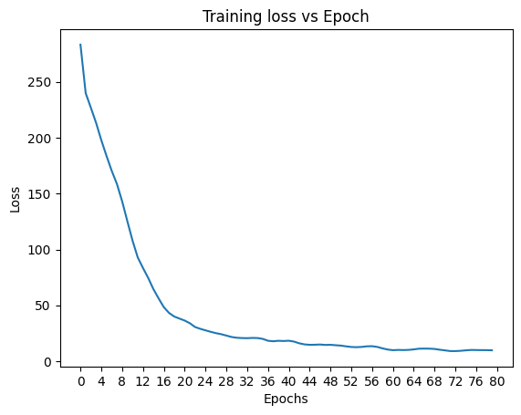
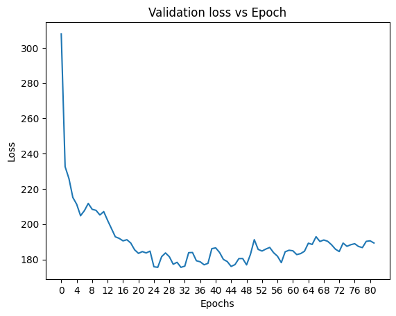
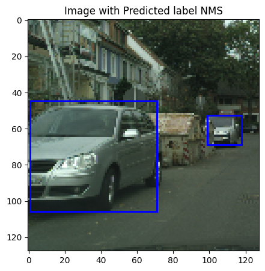
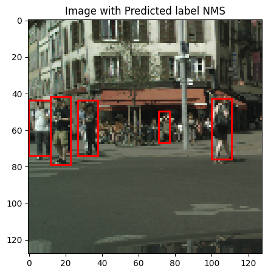
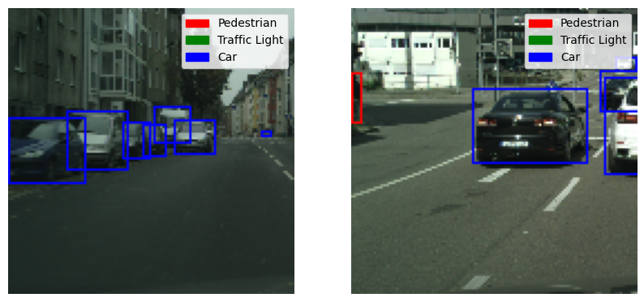
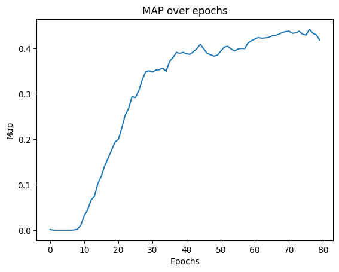

# YOLO Project

## Overview
This project is an implementation of the YOLO (You Only Look Once) object detection model. The project includes training, inference scripts, dataset management, and utility functions.

## Contents
- **Source Code**
  - `yolo_train.py`: Script for training the YOLO model.
  - `yolo_inference.py`: Script for running inference on input images.
  - `datasets/yolo_dataset.py`: Data handling for training and testing.
  - `models/yolo.py`: YOLO model architecture.
  - `losses/yolo_loss.py`: Loss function for YOLO.
  - Utility scripts (`iou.py`, `nms.py`, `plot_utils.py`, `precision_recall.py`).

- **Images and Results**
  - Training and validation loss graphs.
  - Predictions on sample images.
  - Precision-recall and other evaluation metrics.

## Results and Visuals
### Training and Validation Loss



### Model Predictions
- **Sample Prediction 1**  


- **Sample Prediction 2**  


### Precision-Recall and Evaluation Metrics



## How to Run the Project
1. **Training the Model**
   ```
   python yolo_train.py
   ```

2. **Running Inference**
   ```
   python yolo_inference.py --input <input_image_path>
   ```

## Requirements

- Python 3.x
- PyTorch
- NumPy
- Matplotlib
- Additional requirements can be found in `requirements.txt`.

## Usage

Customize the dataset and modify configurations as needed in the `datasets/yolo_dataset.py` script. The output from training and predictions can be visualized using the provided utility scripts.

## Contact

For any questions or issues, please feel free to reach out or contribute to this project.


